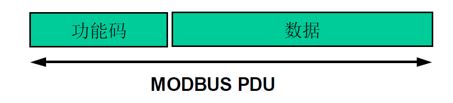
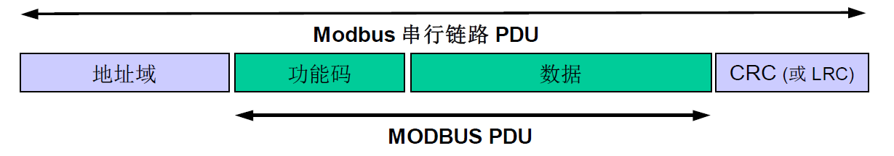
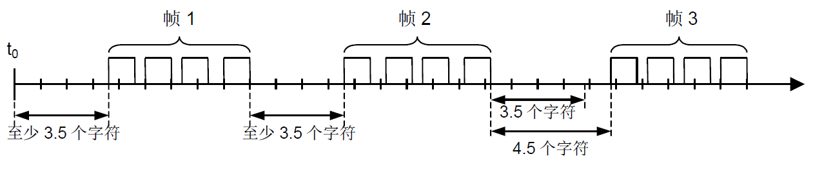
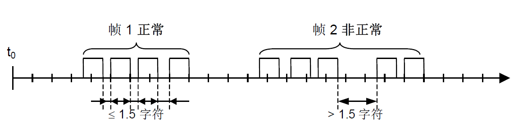
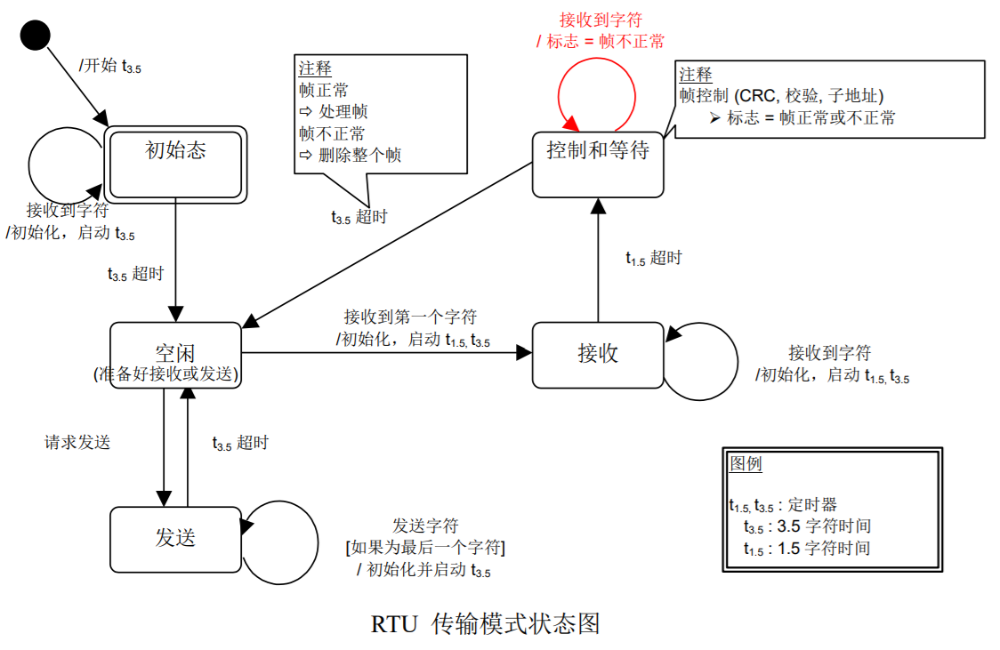
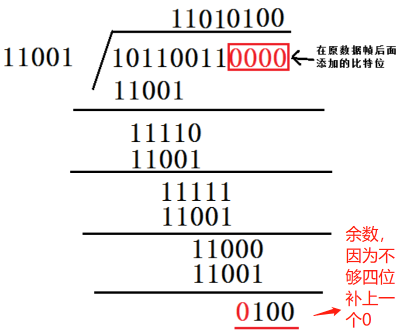
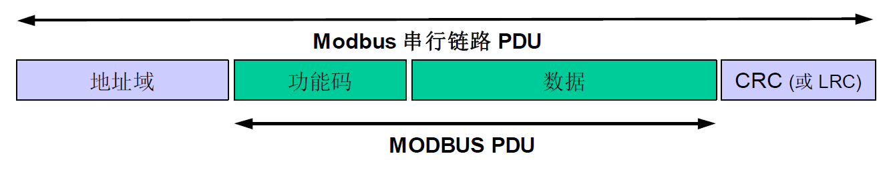
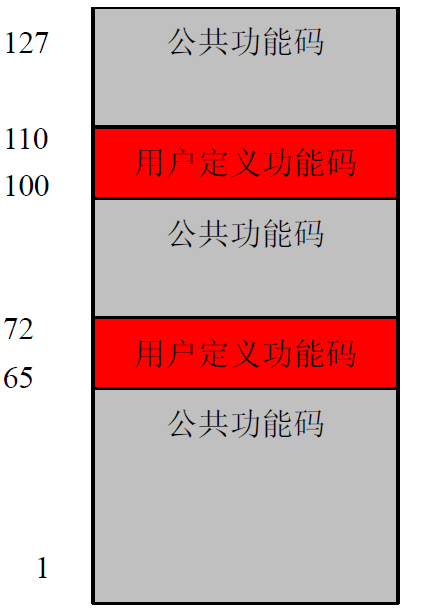

# Modbus协议
## 一、Modbus协议简介
- Modbus 是由 Modicon（现为施耐德电气公司的一个品牌）在 1979 年发明的，是全球第一个真正用于工业现场的总线协议。
- ModBus 网络是一个工业通信系统，由带智能终端的可编程序控制器和计算机通过公用线路或局部专用线路连接而成。其系统结构既包括硬件、亦包括软件。它可应用于各种数据采集和过程监控。
- 为更好地普及和推动 Modbus 在基于以太网上的分布式应用，目前施耐德公司已将 Modbus 协议的所有权移交给 IDA（Interface for Distributed Automation，分布式自动化接口）组织，并成立了Modbus-IDA 组织，为 Modbus 今后的发展奠定了基础。
- 在中国，Modbus 已经成为国家标准。
标准编号：GB/T19582-2008
标准名称：《基于 Modbus 协议的工业自动化网络规范》
分 3 个部分：
《GB/T 19582.1-2008 第 1 部分：Modbus 应用协议》
《GB/T 19582.2-2008 第 2 部分：Modbus 协议在串行链路上的实现指南》
《GB/T 19582.3-2008 第 3 部分: Modbus 协议在 TCP/IP 上的实现指南》

## 二、Modbus协议的应用条件
- MODBUS是应用协议。MODBUS可以在网络协议中应用层中建立(MODBUS TCP),也可以用作普通的串行链路协议(MODBUS RTU/ASCII)

- 在物理层，Modbus串行链路系统可以使用不同的物理接口(RS485、RS232)。

 

MODBUS RTU：

 
MODBUS TCP：

## 三、MODBUS 主站/从站协议原理
- MODBUS串行链路协议是一个主从协议，一个主从类型的系统有一个像某个'子'节点发出显式命令并处理响应的节点（主节点）。典型的子节点在没有收到主节点的请求时并不主动发送数据，也不与其它子节点通讯
- Modbus 串行链路协议是一个主-从协议。在同一时刻，只有一个主节点连接于总线，一个或多个子节点 (最大编号为 247 ) 连接于同一个串行总线。Modbus 通信总是由主节点发起。子节点在没有收到来自主节点的请求时，从不会发送数据。子节点之间从不会互相通信。主节点在同一时刻只会发起一个Modbus 事务处理。
- Modbus主节点以两种模式对子节点发出 Modbus 请求:
 1. 单播模式
主节点以特定地址访问某个子节点，子节点接到并处理完请求后，子节点向主节点返回一个报文(一个'应答')。在这种模式，一个 Modbus 事务处理包含 2 个报文：一个来自主节点的请求，一个来自子节点的应答。
 2. 广播模式
主节点向所有的子节点发送请求。对于主节点广播的请求没有应答返回。广播请求一般用于写命令。所有设备必须接受广播模式的写功能。地址 0 是专门用于表示广播数据的。
- Modbus地址规则：
<table  border="0" align="center">
<tr>
<td align="center">0</td>
<td align="center">1~247</td>
<td align="center">248~55</td>
</tr>
<tr>
<td align="center">广播地址</td>
<td  align="center">子节点单独地址</td>
<td  align="center">保留</td>
</table>

## 四、Modbus数据帧描述
- 《Modbus应用协议》定义了简单的协议数据单元(PDU-Protocol Data Unit)

    
MODBUS协议数据单元

- 发起 Modbus 事务处理的客户端构造 Modbus PDU，然后添加附加的域以构造通信 PDU。

    
MODBUS串行链路上的Modbus帧

- 在Modbus串行链路，地址域只含有子节点地址。

如前文所述，合法的子节点地址为十进制 0 – 247。 每个子设备被赋予 1 – 247 范围中的地址。
主节点通过将子节点的地址放到报文的地址域对子节点寻址。当子节点返回应答时，它将自己的地址放到
应答报文的地址域以让主节点知道哪个子节点在回答。

- 功能码指明服务器要执行的动作。功能码后面可跟有表示含有请求和响应参数的数据域。

- 错误检验域是对报文内容执行 "冗余校验" 的计算结果。根据不同的传输模式 (RTU or ASCII) 使用两种不同的计算方法。

## 五、RTU 传输模式
- 有两种串行传输模式被定义: RTU 模式 和 ASCII 模式。
它定义了报文域的位内容在线路上串行的传送。它确定了信息如何打包为报文和解码。
Modbus 串行链路上所有设备的传输模式 (和串行口参数) 必须相同。

- 尽管在特定的领域 ASCII 模式是要求的，但达到 Modbus 设备之间的互操作性只有每个设备都有相同的模式： 所有设备必须实现 RTU 模式。ASCII 传输模式是选项。

- 当设备使用 RTU (Remote Terminal Unit) 模式在 Modbus 串行链路通信，报文中每个 8 位字节含
有两个 4 位十六进制字符。这种模式的主要优点是较高的数据密度，在相同的波特率下比 ASCII 模式有更
高的吞吐率。每个报文必须以连续的字符流传送。

### RTU模式规则:
- RTU 模式每个字节 ( 11 位 ) 的格式为 :
编码系统: 8–位二进制，报文中每个 8 位字节含有两个 4 位十六进制字符(0–9， A–F)
每字节的 bit 流:
1 起始位
8 数据位， 首先发送最低有效位
1 位作为奇偶校验
1 停止位
偶校验是要求的， 其它模式 ( 奇校验， 无校验 ) 也可以使用。 为了保证与其它产品的最大兼容性，
同时支持无校验模式是建议的。默认校验模式模式 必须为偶校验。
注 : 使用无校验要求 2 个停止位。

- 字符是如何串行传送的：
  1. 每个字符或字节均由此顺序发送(从左到右)：最低有效位 (LSB) . . . 最高有效位 (MSB)

<table  border="0" align="center">

有奇偶校验

<tr>
<td align="center">起始</td>
<td align="center">1</td>
<td align="center">2</td>
<td align="center">3</td>
<td align="center">4</td>
<td align="center">5</td>
<td align="center">6</td>
<td align="center">7</td>
<td align="center">8</td>
<td align="center">校验</td>
<td align="center">停止</td>
</tr>
</table>

   
<b>RTU模式位序列</b>

  2. 设备配置为奇校验、偶校验或无校验都可以接受。如果无奇偶校验，将传送一个附加的停止位以填充字符帧

<table  border="0" align="center">

无奇偶校验

<tr>
<td align="center">起始</td>
<td align="center">1</td>
<td align="center">2</td>
<td align="center">3</td>
<td align="center">4</td>
<td align="center">5</td>
<td align="center">6</td>
<td align="center">7</td>
<td align="center">8</td>
<td align="center">停止</td>
<td align="center">停止</td>
</tr>
</table>

   
<b>RTU模式位序列（无校验的特殊情况）</b>

帧检验域：循环冗余校验 (CRC), 2 字节

- 帧描述： 
<table  border="0" align="center">
<tr>
<td align="center">子节点地址</td>
<td align="center">功能代码</td>
<td align="center">数据</td>
<td align="center">CRC</td>
</tr>
<tr>
<td align="center">1字节</td>
<td align="center">1字节</td>
<td align="center">0~252字节</td>
<td align="center">2字节 CRC低|CRC高</td>
</tr>
</table>

  
<b>Modbus RTU帧总长度最大位256字节</b>

### Modbus报文RTU帧:    

- 由发送设备将 Modbus 报文构造为带有已知起始和结束标记的帧。这使设备可以在报文的开始接收新帧，并且知道何时报文结束。不完整的报文必须能够被检测到而错误标志必须作为结果被设置。
- 在 RTU 模式，报文帧由时长至少为 3.5 个字符时间的空闲间隔区分。在后续的部分，这个时间区间
被称作 t3.5。

- 整个报文帧必须以连续的字符流发送。
- 如果两个字符之间的空闲间隔大于1.5个字符时间，则报文帧被认为不完整应该被接收节点丢弃

- 注 :
RTU 接收驱动程序的实现，由于 t1.5 和 t3.5 的定时，隐含着大量的对中断的管理。在高通信速率下，这导致 CPU 负担加重。因此，在通信速率等于或低于 19200 bps 时，这两个定时必须严格遵守；
对于波特率大于 19200 bps 的情形，应该使用 2 个定时的固定值：
①建议的字符间超时时间(t1.5)为 750µs
②帧间的超时时间 (t1.5) 为 1.750ms。
下图表示了对 RTU 传输模式状态图的描述。 "主节点" 和 "子节点" 的不同角度均在相同的图中表示：

上图状态图的一些解释：
- 从"初始"态到"空闲"态转换需要t3.5定时超时：这保证帧间延迟
- “空闲” 态是没有发送和接收报文要处理的正常状态
- 在 RTU 模式， 当没有活动的传输的时间间隔达 3.5 个字符长时，通信链路被认为在 “空闲” 态。
- 当链路空闲时， 在链路上检测到的任何传输的字符被识别为帧起始。 链路变为 "活动" 状态。 然后，
当链路上没有字符传输的时间间个达到 t3.5 后，被识别为帧结束。
- 检测到帧结束后，完成 CRC 计算和检验。然后，分析地址域以确定帧是否发往此设备，如果不是，则丢弃此帧。 为了减少接收处理时间，地址域可以在一接到就分析，而不需要等到整个帧结束。这样，CRC 计算只需要在帧寻址到该节点 (包括广播帧) 时进行。 

## 七、CRC校验

### 什么是CRC校验
- CRC即循环冗余校验码：是数据通信领域中最常用的一种查错校验码，其特征是信息字段和校验字段的长度可以任意选定。循环冗余检查（CRC）是一种数据传输检错功能，对数据进行多项式计算，并将得到的结果附在帧的后面，接收设备也执行类似的算法，以保证数据传输的正确性和完整性。

<table  border="0" align="center">
<tr>
<td align="center">数据帧</td>
<td align="center">CRC校验字段</td>
</tr>
</table>

### CRC校验原理：

- 其根本思想就是先在要发送的帧后面附加一个数（这个就是用来校验的校验码，但要注意，这里的数也是二进制序列的，下同），生成一个新帧发送给接收端。当然，这个附加的数不是随意的，它要使所生成的新帧能与发送端和接收端共同选定的某个特定数整除（注意，这里不是直接采用二进制除法，而是采用一种称之为“模2除法”）。到达接收端后，再把接收到的新帧除以（同样采用“模2除法”）这个选定的除数。因为在发送端发送数据帧之前就已通过附加一个数，做了“去余”处理（也就已经能整除了），所以结果应该是没有余数。如果有余数，则表明该帧在传输过程中出现了差错。
- 模2除法：
模2除法与算术除法类似，但每一位除的结果不影响其它位，即不向上一位借位，所以实际上就是异或。在循环冗余校验码（CRC）的计算中有应用到模2除法。

### CRC校验步骤：
CRC校验中有两个关键点：
1. 一是预先确定一个发送送端和接收端都用来作为除数的二进制比特串（或多项式），可以随机选择，也可以使用国际标准，但是最高位和最低位必须为1；
2. 二是把原始帧与上面计算出的除数进行模2除法运算，计算出CRC码。

### 具体步骤：
1. 选择合适的除数
2. 看选定除数的二进制位数，然后再要发送的数据帧上面加上这个位数-1位的0，然后用新生成的帧以模2除法的方式除上面的除数，得到的余数就是该帧的CRC校验码。注意，余数的位数一定只比除数位数少一位，也就是CRC校验码位数比除数位数少一位，如果前面位是0也不能省略。
3. 将计算出来的CRC校验码附加在原数据帧后面，构建成一个新的数据帧进行发送；最后接收端在以模2除法方式除以前面选择的除数，如果没有余数，则说明数据帧在传输的过程中没有出错。
 
### CRC校验码计算示例：
现假设选择的CRC生成多项式为G（X） = X4 + X3 + 1，要求出二进制序列10110011的CRC校验码。下面是具体的计算过程：

1. 将多项式转化为二进制序列，由G（X） = X4 + X3 + 1可知二进制一种有五位，第4位、第三位和第零位分别为1，则序列为11001
2. 多项式的位数位5，则在数据帧的后面加上5-1位0，数据帧变为101100110000，然后使用模2除法除以除数11001，得到余数。

3. 将计算出来的CRC校验码添加在原始帧的后面，真正的数据帧为101100110100，再把这个数据帧发送到接收端。
4. 接收端收到数据帧后，用上面选定的除数，用模2除法除去，验证余数是否为0，如果为0，则说明数据帧没有出错。

## 八、ModbusRTU中的CRC校验
- 在 RTU 模式包含一个对全部报文内容执行的，基于循环冗余校验 (CRC - Cyclical Redundancy Checking) 算法的错误检验域。CRC 域检验整个报文的内容。不管报文有无奇偶校验，均执行此检验。
- CRC 包含由两个 8 位字节组成的一个 16 位值。CRC 域作为报文的最后的域附加在报文之后。计算后，首先附加低字节，然后是高字节。CRC 高字节为报文发送的最后一个字节。
- 附加在报文后面的 CRC 的值由发送设备计算。接收设备在接收报文时重新计算 CRC 的值，并将计算结果于实际接收到的 CRC 值相比较。如果两个值不相等，则为错误。
- CRC 的计算, 开始对一个 16 位寄存器预装全 1。然后将报文中的连续的 8 位子节对其进行后续的计算。只有字符中的 8 个数据位参与生成 CRC 的运算，起始位，停止位和校验位不参与 CRC 计算。
- CRC 的生成过程中， 每个 8–位字符与寄存器中的值异或。然后结果向最低有效位(LSB)方向移动(Shift) 1 位，而最高有效位(MSB)位置充零。 然后提取并检查 LSB：如果 LSB 为 1， 则寄存器中的值与一个固定的预置值异或；如果 LSB 为 0， 则不进行异或操作。
这个过程将重复直到执行完 8 次移位。完成最后一次（第 8 次）移位及相关操作后，下一个 8 位字节与寄存器的当前值异或，然后又同上面描述过的一样重复 8 次。当所有报文中子节都运算之后得到的寄存器中的最终值，就是CRC。

- 总结计算过程：
在CRC计算时只用8个数据位，起始位及停止位，如有奇偶校验位也包括奇偶校验位，都不参与CRC计算。
- CRC计算方法是：
1. 预置1个16位的寄存器为十六进制FFFF（全1），此寄存器为CRC寄存器
2. 把第一个8位二进制数据（即通讯信息帧的第一个字节）与16位的CRC寄存器的低八位相异或(模二除法)，把结果存放于CRC寄存器。
3. 把CRC寄存器的内容右移一位（朝低位）用0填补最高位，并检测右移后的移出位。
4. 如果移出位为零，则重复第三步（再次右移一位）；如果移出位为1，CRC寄存器与多项式A001（CRC16位多项式）进行异或。
5. 重复步骤3和4，直到右移8次，这样整个8位数据全部进行了处理。
6. 重复步骤2和5，进行通讯信息帧下一个字节的处理。
7. 将该通讯信息帧所有字节按上述步骤计算完成后，得到的16位CRC寄存器的高、低字节进行交换
8. 最后得到的CRC寄存器内容即为：CRC校验码。

## 九、Modbus事务处理流程
下列状态图描述了在服务器侧MODBUS事物处理的一般处理过程。

一旦服务器处理请求，使用合适的MODBUS 服务器事务建立MODBUS 响应。
根据处理结果，可以建立两种类型响应：
- 一个正确的MODBUS 响应：响应功能码 = 请求功能码
- 一个MODBUS 异常响应：
  1. 用来为客户机提供处理过程中与被发现的差错相关的信息；
  2. 响应功能码 = 请求功能码 + 0x80；
  3. 提供一个异常码来指示差错原因。

## 十、 异常码定义
客户机请求和服务器异常响应的实列：(仅功能码和数据区)

<table  border="0" align="center">
<tr>
<td colspan="2" align="center">请求</td>
<td colspan="2" align="center">响应</td>
</tr>
<tr>
<td align="center">域名</td>
<td align="center">（十六进制）</td>
<td align="center">域名</td>
<td align="center">（十六进制）</td>
</tr>
<tr>
<td align="center">功能</td>
<td align="center">01</td>
<td align="center">功能</td>
<td align="center">81</td>
</tr>
<tr>
<td align="center">起始地址Hi</td>
<td align="center">04</td>
<td align="center">异常码</td>
<td align="center">02</td>
</tr>
<tr>
<td align="center">起始地址Lo</td>
<td align="center">A1</td>
</tr>
<tr>
<td align="center">输出数量Hi</td>
<td align="center">00</td>
</tr>
<tr>
<td align="center">输出数量Lo</td>
<td align="center">01</td>
</tr>
</table>

上面仅列出了功能码域和数据域，对于完整的RTU 帧，还应该有地址域和CRC 域。

在这个实例中，客户机(主机)对服务器(从机)设备寻址请求。功能码(01)用于读输出状态操作。它将请求地址1245(十六进制04A1)的输出状态。值得注意的是，像输出域(0001)号码说明的那样，只读出一个输出。如果在服务器设备中不存在输出地址，那么服务器将返回异常码(02)的异常响应。这就说明从站的非法数据地址。

<table  border="0" align="center">
<tr>
<td colspan="3" align="center">MODBUS异常码</td>
</tr>
<tr>
<td align="center">代码</td>
<td align="center">名称</td>
<td align="center">含义</td>
</tr>
<tr>
<td align="center">01</td>
<td align="center">非法功能</td>
<td align="center">对于服务器(或从站)来说，询问中接收到的功能码是不可允许的操作。这也许是因为功能码仅仅适用于新设备而在被选单元中是不可实现的。同时，还指出服务器(或从站)在错误状态中处理这种请求，例如：因为它是未配置的，并且要求返回寄存器值。
</td>
</tr>
<tr>
<td align="center">02</td>
<td align="center">非法数据地址</td>
<td align="center">对于服务器(或从站)来说，询问中接收到的数据地址是不可允许的地址。特别是，参考号和传输长度的组合是无效的。对于带有100 个寄存器的控制器来说，带有偏移量96 和长度 4 的请求会成功，带有偏移量 96 和长度 5 的请求将产生异常码 02。
</td>
</tr>
<tr>
<td align="center">03</td>
<td align="center">非法数据值</td>
<td align="center">对于服务器(或从站)来说，询问中包括的值是不可允许的值。这个值指示了组合请求剩余结构中的故障，例如：隐含长度是不正确的。并不意味着，因为MODBUS 协议不知道任何特殊寄存器的任何特殊值的重要意义，寄存器中被提交存储的数据项有一个应用程序期望之外的值。</td>
</tr>
<tr>
<td align="center">04</td>
<td align="center">从站设备故障</td>
<td align="center">当服务器(或从站)正在设法执行请求的操作时，产生不可重新获得的差错。</td>
</tr>
<tr>
<td align="center">05</td>
<td align="center">确认</td>
<td align="center">与编程命令一起使用。服务器(或从站)已经接受请求，并切正在处理这个请求，但是需要长的持续时间进行这些操作。返回这个响应防止在客户机(或主站)中发生超时错误。客户机(或主站)可以继续发送轮询程序完成报文来确定是否完成处理。
</td>
</tr>
<tr>
<td align="center">06</td>
<td align="center">从属设备忙</td>
<td align="center">与编程命令一起使用。服务器(或从站)正在处理长持续时间的程序命令。当服务器(或从站)空闲时，用户(或主站)应该稍后重新传输报文。
</td>
</tr>
<tr>
<td align="center">08</td>
<td align="center">存储奇偶性差错</td>
<td align="center">与功能码 20 和 21 以及参考类型 6 一起使用，指示扩展文件区不能通过一致性校验。
服务器(或从站)设法读取记录文件，但是在存储器中发现一个奇偶校验错误。
客户机(或主方)可以重新发送请求，但可以在服务器(或从站)设备上要求服务。</td>
</tr>
<tr>
<td align="center">0A</td>
<td align="center">不可用网关路径</td>
<td align="center">与网关一起使用，指示网关不能为处理请求分配输入端口至输出端口的内部通信路径。通常意味着网关是错误配置的或过载的。</td>
</tr>
<tr>
<td align="center">0B</td>
<td align="center">网关目标设备响应失败</td>
<td align="center">与网关一起使用，指示没有从目标设备中获得响应。通常意味着设备未在网络中。
</td>
</tr>
</table>

## 十一、MODBUS数据类型
- 离散量输入，主要用来读取单个位的数据，如IO的状态；
- 线圈，主要用来写入单个位的数据，与离散量构成组成对位的操作；
- 输入寄存器，主要用来读取16位，也就是两个字节的数据；
- 保持寄存器，主要用来写入16位的数据。

## 十二、MODBUS功能码定义

### Modbus功能码分类
modbus有三类功能码，
它们是：公共功能码、用户定义功能码、保留功能码。

1. 公共功能码
- 是较好地被定义的功能码，
- 保证是唯一的，
- MODBUS 组织可改变的，
- 公开证明的，
- 具有可用的一致性测试，
- MB IETF RFC 中证明的，
- 包含已被定义的公共指配功能码和未来使用的未指配保留供功能码。
2. 用户定义功能码
- 有两个用户定义功能码的定义范围，即 65 至 72 和十进制 100 至 110。
- 用户没有 MODBUS 组织的任何批准就可以选择和实现一个功能码
- 不能保证被选功能码的使用是唯一的。
- 如果用户要重新设置功能作为一个公共功能码，那么用户必须启动 RFC，以便将改变引入公共分类中，并且指配一个新的公共功能码。
3. 保留功能码
- 一些公司对传统产品通常使用的功能码，并且对公共使用是无效的功能码。
### 公共功能码定义
MODBUS 数据模型有四种，通过不同的功能码来读写这些数据对象

<table  border="0" align="center">
<tr>
<td align="center">对象类别</td>
<td align="center">对象类型</td>
<td align="center">访问类型</td>
<td align="center">内容</td>
</tr>
<tr>
<td align="center">离散量输入</td>
<td align="center">单个比特</td>
<td align="center">只读</td>
<td align="center">I/O系统提供这种数据类型</td>
</tr>
<tr>
<td align="center">线圈</td>
<td align="center">单个比特</td>
<td align="center">读写</td>
<td align="center">通过应用程序改变这种数据类型</td>
</tr>
<tr>
<td align="center">输入寄存器</td>
<td align="center">16-比特字</td>
<td align="center">只读</td>
<td align="center">I/O系统提供这种数据类型</td>
</tr>
<tr>
<td align="center">保持寄存器</td>
<td align="center">16-比特字</td>
<td align="center">读写</td>
<td align="center">通过应用程序改变这种数据类型</td>
</tr>
</table>

功能码定义如下：
<table  border="0" align="center">
<tr>
<td align="center" colspan="4"></td>
<td align="center" colspan="2">功能码</td>
<td align="center" colspan="2"></td>
</tr>
<tr>
<td align="center" colspan="4"></td>
<td align="center">码</td>
<td align="center">子码</td>
<td align="center">十六进制</td>
<td align="center">页</td>
</tr>
<tr>
<td align="center" rowspan="13">数据访问</td>
<td align="center" rowspan="5">比特访问</td>
<td align="center" >物理离散量输入</td>
<td align="center" >读输入离散量</td>
<td align="center" >02</td>
<td align="center" ></td>
<td align="center" >02</td>
<td align="center" >11</td>
</tr>
<tr>
<td align="center" rowspan="4">内部比特或物理线圈</td>
<td align="center" >读线圈</td>
<td align="center" >01</td>
<td align="center" ></td>
<td align="center" >01</td>
<td align="center" >10</td>
</tr>
<tr>
<td align="center" >写单个线圈</td>
<td align="center" >05</td>
<td align="center" ></td>
<td align="center" >05</td>
<td align="center" >16</td>
</tr>
<tr>
<td align="center" >写多个线圈</td>
<td align="center" >15</td>
<td align="center" ></td>
<td align="center" >0F</td>
<td align="center" >37</td>
</tr>
<tr>
<td align="center" ></td>
<td align="center" ></td>
<td align="center" ></td>
<td align="center" ></td>
<td align="center" ></td>
</tr>
<tr>
<td align="center" rowspan="6">16比特访问</td>
<td align="center" >输入存储器</td>
<td align="center" >读输入寄存器</td>
<td align="center" >04</td>
<td align="center" ></td>
<td align="center" >04</td>
<td align="center" >14</td>
</tr>
<tr>
<td align="center" rowspan="5">内部存储器或物理输出存储器</td>
<td align="center" >读多个寄存器</td>
<td align="center" >03</td>
<td align="center" ></td>
<td align="center" >03</td>
<td align="center" >13</td>
</tr>
<tr>
<td align="center" >写单个寄存器</td>
<td align="center" >06</td>
<td align="center" ></td>
<td align="center" >06</td>
<td align="center" >17</td>
</tr>
<tr>
<td align="center" >写多个寄存器</td>
<td align="center" >16</td>
<td align="center" ></td>
<td align="center" >10</td>
<td align="center" >39</td>
</tr>
<tr>
<td align="center" >读/写多个寄存器</td>
<td align="center" >23</td>
<td align="center" ></td>
<td align="center" >17</td>
<td align="center" >47</td>
</tr>
<tr>
<td align="center" >屏蔽写寄存器</td>
<td align="center" >22</td>
<td align="center" ></td>
<td align="center" >16</td>
<td align="center" >46</td>
</tr>
<tr>
<td align="center" colspan="2" rowspan="2">文件记录访问</td>
<td align="center" >读文件记录</td>
<td align="center" >20</td>
<td align="center" >6</td>
<td align="center" >14</td>
<td align="center" >42</td>
</tr>
<tr>
<td align="center" >写文件记录</td>
<td align="center" >21</td>
<td align="center" >6</td>
<td align="center" >15</td>
<td align="center" >44</td>
</tr>
<tr>
<td align="center" colspan="3">封装接口</td>
<td align="center" >读设备识别码</td>
<td align="center" >43</td>
<td align="center" >14</td>
<td align="center" >2B</td>
<td align="center" ></td>
</tr>
</table>
最常用的功能码有：01、02、03、04、05、15、16。
下面，我们会介绍每个功能码对应的数据域格式。

### 读线圈寄存器01H
- 描述
读 MODBUS 从机线圈寄存器当前状态。
- 查询
例如从机地址为 11H，线圈寄存器的起始地址为 0013H，结束地址为 0037H。该次查询总共访问 37 个线圈寄存器。

<table  border="0" align="center">

 <b>读线圈寄存器-查询</b>

<tr>
<td align="center"></td>
<td align="center">Hex</td>
</tr>
<tr>
<td align="center">从机地址</td>
<td align="center">11</td>
</tr>
<tr>
<td align="center">功能码</td>
<td align="center">01</td>
</tr>
<tr>
<td align="center">寄存器起始地址高字节</td>
<td align="center">00</td>
</tr>
<tr>
<td align="center">寄存器起始地址低字节</td>
<td align="center">13</td>
</tr>
<tr>
<td align="center">寄存器数量高字节</td>
<td align="center">00</td>
</tr>
<tr>
<td align="center">寄存器数量低字节</td>
<td align="center">25</td>
</tr>
<tr>
<td align="center">CRC校验高字节</td>
<td align="center">0E</td>
</tr>
<tr>
<td align="center">CRC校验低字节</td>
<td align="center">84</td>
</tr>
</table>

- 响应
响应负载中的各线圈状态与数据内容每位相对应。1 代表 ON，0 代表 OFF。若返回的线圈数不为 8 的倍数，则在最后数据字节未尾使用 0 代替。

<table  border="0" align="center">

<b>读线圈寄存器-响应</b>

<tr>
<td align="center"></td>
<td align="center">Hex</td>
</tr>
<tr>
<td align="center">从机地址</td>
<td align="center">11</td>
</tr>
<tr>
<td align="center">功能码</td>
<td align="center">01</td>
</tr>
<tr>
<td align="center">返回字节数</td>
<td align="center">05</td>
</tr>
<tr>
<td align="center">数据1(线圈0013H-线圈001AH)</td>
<td align="center">CD</td>
</tr>
<tr>
<td align="center">数据2(线圈001BH-线圈0022H)</td>
<td align="center">6B</td>
</tr>
<tr>
<td align="center">数据3(线圈0023H-线圈002AH)</td>
<td align="center">B2</td>
</tr>
<tr>
<td align="center">数据4(线圈0032H-线圈002BH)</td>
<td align="center">0E</td>
</tr>
<tr>
<td align="center">数据5(线圈0037H-线圈0033H)</td>
<td align="center">1B</td>
</tr>
<tr>
<td align="center">CRC校验高字节</td>
<td align="center">45</td>
</tr>
<tr>
<td align="center">CRC校验低字节</td>
<td align="center">E6</td>
</tr>
</table>

- 线圈 0013H 到线圈 001AH 的状态为 CDH，二进制值为 11001101，该字节的最高字节为线圈001AH ， 最 低 字 节 为 线 圈 0013H 。线圈 001AH 到 线 圈 0013H 的 状 态 分 别 为
ON-ON-OFF-OFF-ON-ON-OFF-ON

<table  border="0" align="center">

<b>线圈0013H到001A状态</b>

<tr>
<td align="center">
001AH
</td>
<td align="center">
0019H
</td>
<td align="center">
0018H
</td>
<td align="center">
0017H
</td>
<td align="center">
0016H
</td>
<td align="center">
0015H
</td>
<td align="center">
0014H
</td>
<td align="center">
0013H
</td>
</tr>
<tr>
<td align="center">
ON
</td>
<td align="center">
ON
</td>
<td align="center">
OFF
</td>
<td align="center">
OFF
</td>
<td align="center">
ON
</td>
<td align="center">
ON
</td>
<td align="center">
OFF
</td>
<td align="center">
ON
</td>
</tr>
</table>

- 最后一个数据字节中，线圈 0033H 到线圈 0037 状态为 1BH(二进制 00011011)，线圈 0037H。是左数第 4 位，线圈 0033H 为该字节的最低字节，线圈 0037H 至线圈 0033H 的状态分别为ON-ON-OFF-ON-ON，剩余 3 位使用 0 填充。

<table  border="0" align="center">

<b>线圈0033H到线圈0037状态</b>

<tr>
<td align="center">
003AH
</td>
<td align="center">
0039H
</td>
<td align="center">
0038H
</td>
<td align="center">
0037H
</td>
<td align="center">
0036H
</td>
<td align="center">
0035H
</td>
<td align="center">
0034H
</td>
<td align="center">
0033H
</td>
</tr>
<tr>
<td align="center">
填充
</td>
<td align="center">
填充
</td>
<td align="center">
填充
</td>
<td align="center">
ON
</td>
<td align="center">
ON
</td>
<td align="center">
OFF
</td>
<td align="center">
ON
</td>
<td align="center">
ON
</td>
</tr>
</table>

### 读离散输入寄存器02H
- 说明
读离散输入寄存器状态。
- 查询
从机地址为 11H。离散输入寄存器的起始地址为 00C4H，结束寄存器地址为 00D9H。总共访问32 个离散输入寄存器。

<table  border="0" align="center">

 <b>读离散输入寄存器-查询</b>

<tr>
<td align="center"></td>
<td align="center">Hex</td>
</tr>
<tr>
<td align="center">从机地址</td>
<td align="center">11</td>
</tr>
<tr>
<td align="center">功能码</td>
<td align="center">02</td>
</tr>
<tr>
<td align="center">寄存器起始地址高字节</td>
<td align="center">00</td>
</tr>
<tr>
<td align="center">寄存器起始地址低字节</td>
<td align="center">C4</td>
</tr>
<tr>
<td align="center">寄存器数量高字节</td>
<td align="center">00</td>
</tr>
<tr>
<td align="center">寄存器数量低字节</td>
<td align="center">16</td>
</tr>
<tr>
<td align="center">CRC校验高字节</td>
<td align="center">BA</td>
</tr>
<tr>
<td align="center">CRC校验低字节</td>
<td align="center">A9</td>
</tr>
</table>

- 响应
响应各离散输入寄存器状态，分别对应数据区中的每位值，1 代表 ON；0 代表 OFF。第一个数据字节的 LSB(最低字节)为查询的寻址地址，其他输入口按顺序在该字节中由低字节向高字节排列，直到填充满 8 位。下一个字节中的 8 个输入位也是从低字节到高字节排列。若返回的输入位数不是 8的倍数，则在最后的数据字节中的剩余位至该字节的最高位使用 0 填充。

<table  border="0" align="center">

 <b>读输入寄存器-响应</b>

<tr>
<td align="center"></td>
<td align="center">Hex</td>
</tr>
<tr>
<td align="center">从机地址</td>
<td align="center">11</td>
</tr>
<tr>
<td align="center">功能码</td>
<td align="center">02</td>
</tr>
<tr>
<td align="center">返回字节数</td>
<td align="center">03</td>
</tr>
<tr>
<td align="center">数据1(00C4H-00CBH)</td>
<td align="center">AC</td>
</tr>
<tr>
<td align="center">数据2(00CCH-00D3H)</td>
<td align="center">DB</td>
</tr>
<tr>
<td align="center">数据3(00D4H-00D9H)</td>
<td align="center">35</td>
</tr>
<tr>
<td align="center">CRC校验高字节</td>
<td align="center">20</td>
</tr>
<tr>
<td align="center">CRC校验低字节</td>
<td align="center">18</td>
</tr>
</table>

离散输入寄存器 00D4H 到 00D9H 的状态为 35H (二进制 00110101)。输入寄存器 00D9H 为左数第 3 位，输入寄存器 00D4 为最低位，输入寄存器 00D9H 到 00D4H 的状态分别为ON-ON-OFF-ON-OFF-ON。00DBH 寄存器和 00DAH 寄存器被 0 填充。

<table  border="0" align="center">
<tr>

<b>离散输入寄存器00C4H到00DBH状态</b>

<td align="center">
00CBH
</td>
<td align="center">
00CAH
</td>
<td align="center">
00C9H
</td>
<td align="center">
00C8H
</td>
<td align="center">
00C7H
</td>
<td align="center">
00C6H
</td>
<td align="center">
00C5H
</td>
<td align="center">
00C4H
</td>
</tr>
<tr>
<td align="center">
0
</td>
<td align="center">
0
</td>
<td align="center">
1
</td>
<td align="center">
1
</td>
<td align="center">
0
</td>
<td align="center">
1
</td>
<td align="center">
0
</td>
<td align="center">
1
</td>
</tr>
<tr>
<td align="center">
00D3H
</td>
<td align="center">
00D2H
</td>
<td align="center">
00D1H
</td>
<td align="center">
00D0H
</td>
<td align="center">
00CFH
</td>
<td align="center">
00CEH
</td>
<td align="center">
00CDH
</td>
<td align="center">
00CCH
</td>
</tr>
<tr>
<td align="center">
1
</td>
<td align="center">
1
</td>
<td align="center">
1
</td>
<td align="center">
0
</td>
<td align="center">
1
</td>
<td align="center">
0
</td>
<td align="center">
1
</td>
<td align="center">
1
</td>
</tr>
<tr>
<td align="center">
00DBH
</td>
<td align="center">
00DAH
</td>
<td align="center">
00D9H
</td>
<td align="center">
00D8H
</td>
<td align="center">
00D7H
</td>
<td align="center">
00D6H
</td>
<td align="center">
00D5H
</td>
<td align="center">
00D4H
</td>
</tr>
<tr>
<td align="center">
填充
</td>
<td align="center">
填充
</td>
<td align="center">
1
</td>
<td align="center">
1
</td>
<td align="center">
0
</td>
<td align="center">
1
</td>
<td align="center">
0
</td>
<td align="center">
1
</td>
</tr>
</table>

### 读保持寄存器03H
- 说明
读保持寄存器。可读取单个或多个保持寄存器。
- 查询
从机地址为 11H。保持寄存器的起始地址为 006BH，结束地址为 006DH。该次查询总共访问多个保持寄存器。
<table  border="0" align="center">

 <b>读保持寄存器-查询</b>

<tr>
<td align="center"></td>
<td align="center">Hex</td>
</tr>
<tr>
<td align="center">从机地址</td>
<td align="center">11</td>
</tr>
<tr>
<td align="center">功能码</td>
<td align="center">03</td>
</tr>
<tr>
<td align="center">寄存器起始地址高字节</td>
<td align="center">00</td>
</tr>
<tr>
<td align="center">寄存器起始地址低字节</td>
<td align="center">6B</td>
</tr>
<tr>
<td align="center">寄存器数量高字节</td>
<td align="center">00</td>
</tr>
<tr>
<td align="center">寄存器数量低字节</td>
<td align="center">03</td>
</tr>
<tr>
<td align="center">CRC校验高字节</td>
<td align="center">76</td>
</tr>
<tr>
<td align="center">CRC校验低字节</td>
<td align="center">87</td>
</tr>
</table>

- 响应
保持寄存器的长度为 2 个字节。对于单个保持寄存器而言，寄存器高字节数据先被传输，低字节数据后被传输。保持寄存器之间，低地址寄存器先被传输，高地址寄存器后被传输。
<table  border="0" align="center">

<b>读保持寄存器-响应</b>

<tr>
<td align="center"></td>
<td align="center">Hex</td>
</tr>
<tr>
<td align="center">从机地址</td>
<td align="center">11</td>
</tr>
<tr>
<td align="center">功能码</td>
<td align="center">03</td>
</tr>
<tr>
<td align="center">字节数</td>
<td align="center">06</td>
</tr>
<tr>
<td align="center">数据1高字节</td>
<td align="center">00</td>
</tr>
<tr>
<td align="center">数据1低字节</td>
<td align="center">6B</td>
</tr>
<tr>
<td align="center">数据2高字节</td>
<td align="center">00</td>
</tr>
<tr>
<td align="center">数据2低字节</td>
<td align="center">13</td>
</tr>
<tr>
<td align="center">数据3高字节</td>
<td align="center">00</td>
</tr>
<tr>
<td align="center">数据3低字节</td>
<td align="center">00</td>
</tr>
<tr>
<td align="center">CRC校验高字节</td>
<td align="center">38</td>
</tr>
<tr>
<td align="center">CRC校验低字节</td>
<td align="center">B9</td>
</tr>
</table>

<table  border="0" align="center">
<tr>

<b>保持寄存器006BH到006DH结果</b>

<td align="center">
006BH高字节
</td>
<td align="center">
006BH高字节
</td>
<td align="center">
006CH高字节
</td>
<td align="center">
006CH低字节
</td>
<td align="center">
006DH高字节
</td>
<td align="center">
006DH低字节
</td>
</tr>
<tr>
<td align="center">
00
</td>
<td align="center">
6B
</td>
<td align="center">
00
</td>
<td align="center">
13
</td>
<td align="center">
00
</td>
<td align="center">
00
</td>
</tr>
</table>

### 输入寄存器04H
- 说明
读输入寄存器命令。该命令支持单个寄存器访问也支持多个寄存器访问。
- 查询
从机地址为 11H。输入寄存器的起始地址为 0008H，寄存器的结束地址为 0009H。本次访问访2 个输入寄存器。
<table  border="0" align="center">

 <b>读输入寄存器-查询</b>

<tr>
<td align="center"></td>
<td align="center">Hex</td>
</tr>
<tr>
<td align="center">从机地址</td>
<td align="center">11</td>
</tr>
<tr>
<td align="center">功能码</td>
<td align="center">04</td>
</tr>
<tr>
<td align="center">寄存器起始地址高字节</td>
<td align="center">00</td>
</tr>
<tr>
<td align="center">寄存器起始地址低字节</td>
<td align="center">08</td>
</tr>
<tr>
<td align="center">寄存器数量高字节</td>
<td align="center">00</td>
</tr>
<tr>
<td align="center">寄存器数量低字节</td>
<td align="center">02</td>
</tr>
<tr>
<td align="center">CRC校验高字节</td>
<td align="center">F2</td>
</tr>
<tr>
<td align="center">CRC校验低字节</td>
<td align="center">99</td>
</tr>
</table>

- 响应
输入寄存器长度为 2 个字节。对于单个输入寄存器而言，寄存器高字节数据先被传输，低字节数据被传输。输入寄存器之间，低地址寄存器先被传输，高地址寄存器后被传输。
<table  border="0" align="center">

 <b>读输入寄存器-响应</b>

<tr>
<td align="center"></td>
<td align="center">Hex</td>
</tr>
<tr>
<td align="center">从机地址</td>
<td align="center">11</td>
</tr>
<tr>
<td align="center">功能码</td>
<td align="center">04</td>
</tr>
<tr>
<td align="center">字节数</td>
<td align="center">04</td>
</tr>
<tr>
<td align="center">数据1高字节(0008H)</td>
<td align="center">00</td>
</tr>
<tr>
<td align="center">数据1低字节(0008H)</td>
<td align="center">0A</td>
</tr>
<tr>
<td align="center">数据2高字节(0009H)</td>
<td align="center">00</td>
</tr>
<tr>
<td align="center">数据2高字节(0009H)</td>
<td align="center">0B</td>
</tr>
<tr>
<td align="center">CRC校验高字节</td>
<td align="center">8B</td>
</tr>
<tr>
<td align="center">CRC校验低字节</td>
<td align="center">80</td>
</tr>
</table>

<table  border="0" align="center">
<tr>

<b>输入寄存器0008H到0009H结果</b>

<td align="center">
006BH高字节
</td>
<td align="center">
006BH低字节
</td>
<td align="center">
006CH高字节
</td>
<td align="center">
006CH低字节
</td>
</tr>
<tr>
<td align="center">
00
</td>
<td align="center">
0A
</td>
<td align="center">
00
</td>
<td align="center">
0B
</td>
</tr>
</table>

### 写单个线圈寄存器 05H
- 说明
写单个线圈寄存器。FF00H 值请求线圈处于 ON 状态，0000H 值请求线圈处于 OFF 状态。05H指令设置单个线圈的状态，15H 指令可以设置多个线圈的状态，两个指令虽然都设定线圈的 ON/OFF状态，但是 ON/OFF 的表达方式却不同。
- 查询
从机地址为 11H，线圈寄存器的地址为 00ACH。使 00ACH 线圈处于 ON 状态，即数据内容为FF00H。

<table  border="0" align="center">

 <b>写单个线圈寄存器-查询</b>

<tr>
<td align="center"></td>
<td align="center">Hex</td>
</tr>
<tr>
<td align="center">从机地址</td>
<td align="center">11</td>
</tr>
<tr>
<td align="center">功能码</td>
<td align="center">05</td>
</tr>
<tr>
<td align="center">寄存器地址高字节</td>
<td align="center">00</td>
</tr>
<tr>
<td align="center">寄存器地址低字节</td>
<td align="center">AC</td>
</tr>
<tr>
<td align="center">数据1高字节</td>
<td align="center">FF</td>
</tr>
<tr>
<td align="center">数据1低字节</td>
<td align="center">00</td>
</tr>
<tr>
<td align="center">CRC校验高字节</td>
<td align="center">4E</td>
</tr>
<tr>
<td align="center">CRC校验低字节</td>
<td align="center">8B</td>
</tr>
</table>

- 响应
<table  border="0" align="center">

 <b>强制单个线圈-响应</b>

<tr>
<td align="center"></td>
<td align="center">Hex</td>
</tr>
<tr>
<td align="center">从机地址</td>
<td align="center">11</td>
</tr>
<tr>
<td align="center">功能码</td>
<td align="center">05</td>
</tr>
<tr>
<td align="center">寄存器地址高字节</td>
<td align="center">00</td>
</tr>
<tr>
<td align="center">寄存器地址低字节</td>
<td align="center">AC</td>
</tr>
<tr>
<td align="center">寄存器1高字节</td>
<td align="center">FF</td>
</tr>
<tr>
<td align="center">寄存器1低字节</td>
<td align="center">00</td>
</tr>
<tr>
<td align="center">CRC校验高字节</td>
<td align="center">4E</td>
</tr>
<tr>
<td align="center">CRC校验低字节</td>
<td align="center">8B</td>
</tr>
</table>

### 写单个保持寄存器 06H
- 说明
写保持寄存器。注意 06 指令只能操作单个保持寄存器，16 指令可以设置单个或多个保持寄存器。
- 查询
从机地址为 11H。保持寄存器地址为 0001H。寄存器内容为 0003H。

<table  border="0" align="center">

 <b>写单个保持寄存器-查询</b>

<tr>
<td align="center"></td>
<td align="center">Hex</td>
</tr>
<tr>
<td align="center">从机地址</td>
<td align="center">11</td>
</tr>
<tr>
<td align="center">功能码</td>
<td align="center">06</td>
</tr>
<tr>
<td align="center">寄存器地址高字节</td>
<td align="center">00</td>
</tr>
<tr>
<td align="center">寄存器地址低字节</td>
<td align="center">01</td>
</tr>
<tr>
<td align="center">数据1高字节</td>
<td align="center">00</td>
</tr>
<tr>
<td align="center">数据1低字节</td>
<td align="center">01</td>
</tr>
<tr>
<td align="center">CRC校验高字节</td>
<td align="center">9A</td>
</tr>
<tr>
<td align="center">CRC校验低字节</td>
<td align="center">9B</td>
</tr>
</table>

- 响应
<table  border="0" align="center">

 <b>写单个保持寄存器-响应</b>

<tr>
<td align="center"></td>
<td align="center">Hex</td>
</tr>
<tr>
<td align="center">从机地址</td>
<td align="center">11</td>
</tr>
<tr>
<td align="center">功能码</td>
<td align="center">06</td>
</tr>
<tr>
<td align="center">寄存器地址高字节</td>
<td align="center">00</td>
</tr>
<tr>
<td align="center">寄存器地址低字节</td>
<td align="center">01</td>
</tr>
<tr>
<td align="center">寄存器1高字节</td>
<td align="center">00</td>
</tr>
<tr>
<td align="center">寄存器1低字节</td>
<td align="center">01</td>
</tr>
<tr>
<td align="center">CRC校验高字节</td>
<td align="center">1B</td>
</tr>
<tr>
<td align="center">CRC校验低字节</td>
<td align="center">5A</td>
</tr>
</table>

### 写多个保持寄存器10H
- 说明
写多个保持寄存器
- 查询
从机地址为11H。保持寄存器的起始地址为0001H，寄存器的结束地址为0002H。总共访问 2个寄存器。保持寄存器 0001H 的内容为 000AH，保持寄存器 0002H 的内容为 0102H。

<table  border="0" align="center">

 <b>写多个保持寄存器-查询</b>

<tr>
<td align="center"></td>
<td align="center">Hex</td>
</tr>
<tr>
<td align="center">从机地址</td>
<td align="center">11</td>
</tr>
<tr>
<td align="center">功能码</td>
<td align="center">10</td>
</tr>
<tr>
<td align="center">寄存器地址高字节</td>
<td align="center">00</td>
</tr>
<tr>
<td align="center">寄存器地址低字节</td>
<td align="center">01</td>
</tr>
<tr>
<td align="center">寄存器数量高字节</td>
<td align="center">00</td>
</tr>
<tr>
<td align="center">寄存器数量低字节</td>
<td align="center">02</td>
</tr>
<tr>
<td align="center">字节数</td>
<td align="center">04</td>
</tr>
<tr>
<td align="center">数据1高字节</td>
<td align="center">00</td>
</tr>
<tr>
<td align="center">数据1低字节</td>
<td align="center">0A</td>
</tr>
<tr>
<td align="center">数据2高字节</td>
<td align="center">01</td>
</tr>
<tr>
<td align="center">数据2低字节</td>
<td align="center">02</td>
</tr>
<tr>
<td align="center">CRC校验高字节</td>
<td align="center">C6</td>
</tr>
<tr>
<td align="center">CRC校验低字节</td>
<td align="center">F0</td>
</tr>
</table>

<table>

 <b>保持寄存器0001H到
0002H内容</b>

<tr>
<td>
地址
</td>
<td>
0001H高字节
</td>
<td>
0001H低字节
</td>
<td>
0002H高字节
</td>
<td>
0003H低字节
</td>
</tr>
<td>
数值
</td>
<td>
00
</td>
<td>
0A
</td>
<td>
01
</td>
<td>
12
</td>
</tr>
</table>

- 响应
<table  border="0" align="center">

 <b>写多个保持寄存器-响应</b>

<tr>
<td align="center"></td>
<td align="center">Hex</td>
</tr>
<tr>
<td align="center">从机地址</td>
<td align="center">11</td>
</tr>
<tr>
<td align="center">功能码</td>
<td align="center">10</td>
</tr>
<tr>
<td align="center">寄存器地址高字节</td>
<td align="center">00</td>
</tr>
<tr>
<td align="center">寄存器地址低字节</td>
<td align="center">01</td>
</tr>
<tr>
<td align="center">寄存器数量高字节</td>
<td align="center">00</td>
</tr>
<tr>
<td align="center">寄存器数量低字节</td>
<td align="center">02</td>
</tr>
<tr>
<td align="center">CRC校验高字节</td>
<td align="center">12</td>
</tr>
<tr>
<td align="center">CRC校验低字节</td>
<td align="center">98</td>
</tr>
</table>

### 写多个线圈寄存器0FH
- 说明
写多个线圈寄存器。若数据区的某位值为“1”表示被请求的相应线圈状态为 ON，若某位值为“0”，则为状态为 OFF。
- 查询
从机地址为 11H，线圈寄存器的起始地址为 0013H，线圈寄存器的结束地址为 001CH。总共访问 10 个寄存器。寄存器内容如下表所示。
<table  border="0" align="center">

<b>线圈寄存器0013H到001CH</b>

<tr>
<td align="center">
001AH
</td>
<td align="center">
0019H
</td>
<td align="center">
0018H
</td>
<td align="center">
0017H
</td>
<td align="center">
0016H
</td>
<td align="center">
0015H
</td>
<td align="center">
0014H
</td>
<td align="center">
0013H
</td>
</tr>
<tr>
<td align="center">
1
</td>
<td align="center">
1
</td>
<td align="center">
0
</td>
<td align="center">
0
</td>
<td align="center">
1
</td>
<td align="center">
1
</td>
<td align="center">
0
</td>
<td align="center">
1
</td>
</tr>
<tr>
<td align="center">
0022H
</td>
<td align="center">
0021H
</td>
<td align="center">
0020H
</td>
<td align="center">
001FH
</td>
<td align="center">
001EH
</td>
<td align="center">
001DH
</td>
<td align="center">
001CH
</td>
<td align="center">
001BH
</td>
</tr>
<tr>
<td align="center">
0
</td>
<td align="center">
0
</td>
<td align="center">
0
</td>
<td align="center">
0
</td>
<td align="center">
0
</td>
<td align="center">
0
</td>
<td align="center">
0
</td>
<td align="center">
1
</td>
</tr>
</table>
传输的第一个字节 CDH 对应线圈为 0013H 到 001AH，LSB（最低位）对应线圈 0013H，传输
第二个字节为 01H，对应的线圈为 001BH 到 001CH，LSB 对应线圈 001CH，其余未使用位使用 0 填
充。

<table  border="0" align="center">

 <b>写多个保持寄存器-查询</b>

<tr>
<td align="center"></td>
<td align="center">Hex</td>
</tr>
<tr>
<td align="center">从机地址</td>
<td align="center">11</td>
</tr>
<tr>
<td align="center">功能码</td>
<td align="center">0F</td>
</tr>
<tr>
<td align="center">寄存器地址高字节</td>
<td align="center">00</td>
</tr>
<tr>
<td align="center">寄存器地址低字节</td>
<td align="center">13</td>
</tr>
<tr>
<td align="center">寄存器数量高字节</td>
<td align="center">00</td>
</tr>
<tr>
<td align="center">寄存器数量低字节</td>
<td align="center">0A</td>
</tr>
<tr>
<td align="center">字节数</td>
<td align="center">02</td>
</tr>
<tr>
<td align="center">数据1(0013H-001AH)</td>
<td align="center">CD</td>
</tr>
<tr>
<td align="center">数据2(001BH-001CH))</td>
<td align="center">01</td>
</tr>
<tr>
<td align="center">CRC校验高字节</td>
<td align="center">BF</td>
</tr>
<tr>
<td align="center">CRC校验低字节</td>
<td align="center">0B</td>
</tr>
</table>

-响应
<table  border="0" align="center">

 <b>写多个保持寄存器-查询</b>

<tr>
<td align="center"></td>
<td align="center">Hex</td>
</tr>
<tr>
<td align="center">从机地址</td>
<td align="center">11</td>
</tr>
<tr>
<td align="center">功能码</td>
<td align="center">0F</td>
</tr>
<tr>
<td align="center">寄存器地址高字节</td>
<td align="center">00</td>
</tr>
<tr>
<td align="center">寄存器地址低字节</td>
<td align="center">13</td>
</tr>
<tr>
<td align="center">寄存器数量高字节</td>
<td align="center">00</td>
</tr>
<tr>
<td align="center">寄存器数量低字节</td>
<td align="center">0A</td>
</tr>
<tr>
<td align="center">字节数</td>
<td align="center">02</td>
</tr>
<tr>
<td align="center">CRC校验高字节</td>
<td align="center">99</td>
</tr>
<tr>
<td align="center">CRC校验低字节</td>
<td align="center">1B</td>
</tr>
</table>